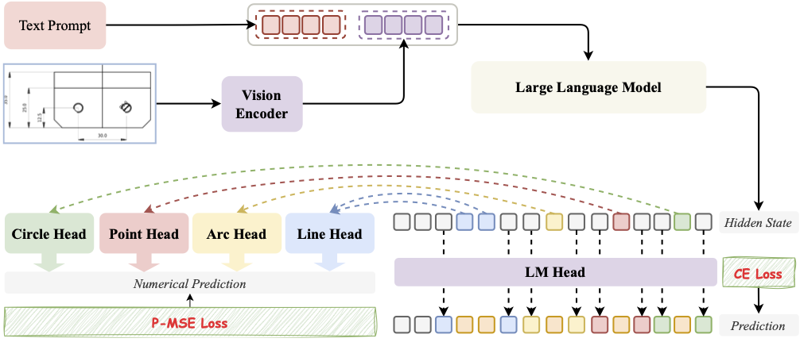
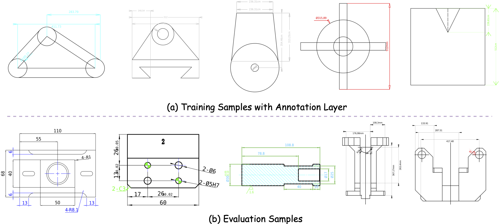

# PHT-CAD: Efficient CAD Parametric Primitive Analysis with Progressive Hierarchical Tuning

## Introduction

We propose PHT-CAD, a novel 2D PPA framework that harnesses the modality alignment and reasoning capabilities of Vision-Language Models (VLMs) for precise engineering drawing analysis. In PHT-CAD, we introduce four dedicated regression heads to predict corresponding atomic components. To train PHT-CAD, a three-stage training paradigm Progressive Hierarchical Tuning (PHT) is proposed to progressively enhance PHT-CAD's capability to perceive individual primitives, infer structural constraints, and align annotation layers with their corresponding geometric representations. Considering that existing datasets lack complete annotation layers and real-world engineering drawings, we introduce ParaCAD, the first large-scale benchmark that explicitly integrates both the geometric and annotation layers. ParaCAD comprises over 10 million annotated drawings for training and 3,000 real-world industrial drawings with complex topological structures and physical constraints for test. Extensive experiments demonstrate the effectiveness of PHT-CAD and highlight the practical significance of ParaCAD in advancing 2D PPA research.
    
You can view our paper through the following link: [Paper](https://arxiv.org/abs/2502.19958)

## ParaCAD benchmark

We present ParaCAD, the first large-scale 2D PPA benchmark that incorporates the annotation layer. ParaCAD includes 10.26 million annotated engineering drawings for training and 3,000 real-world industrial drawings for test. The samples for test exhibit higher topological complexity and adhere to physical constraints. The dataset can be accessed here: [Dataset](https://www.modelscope.cn/datasets/yuwenbonnie/ParaCAD-Dataset/summary)

## Performance

| Model       | Release Date | Max Length | System Prompt Enhancement | # of Pretrained Tokens | Minimum GPU Memory Usage of Finetuning (Q-Lora) | Minimum GPU Usage of Generating 2048 Tokens (Int4) | Tool Usage |
|-------------|--------------|------------|---------------------------|------------------------|-------------------------------------------------|----------------------------------------------------|------------|
| Qwen-1.8B   | 23.11.30     | 32K        | ✅                         | 2.2T                   | 5.8GB                                           | 2.9GB                                              | ✅          |
| Qwen-7B     | 23.08.03     | 32K        | ❌                         | 2.4T                   | 11.5GB                                          | 8.2GB                                              | ✅          |
| Qwen-14B    | 23.09.25     | 8K         | ❌                         | 3.0T                   | 18.7GB                                          | 13.0GB                                             | ✅          |
| Qwen-72B    | 23.11.30     | 32K        | ✅                         | 3.0T                   | 61.4GB                                          | 48.9GB                                             | ✅          |
