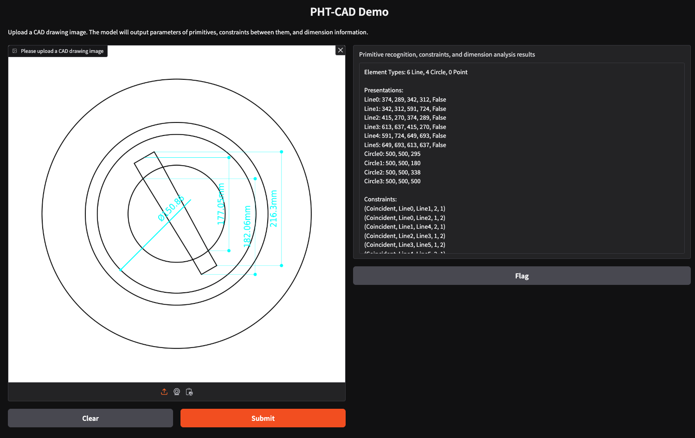
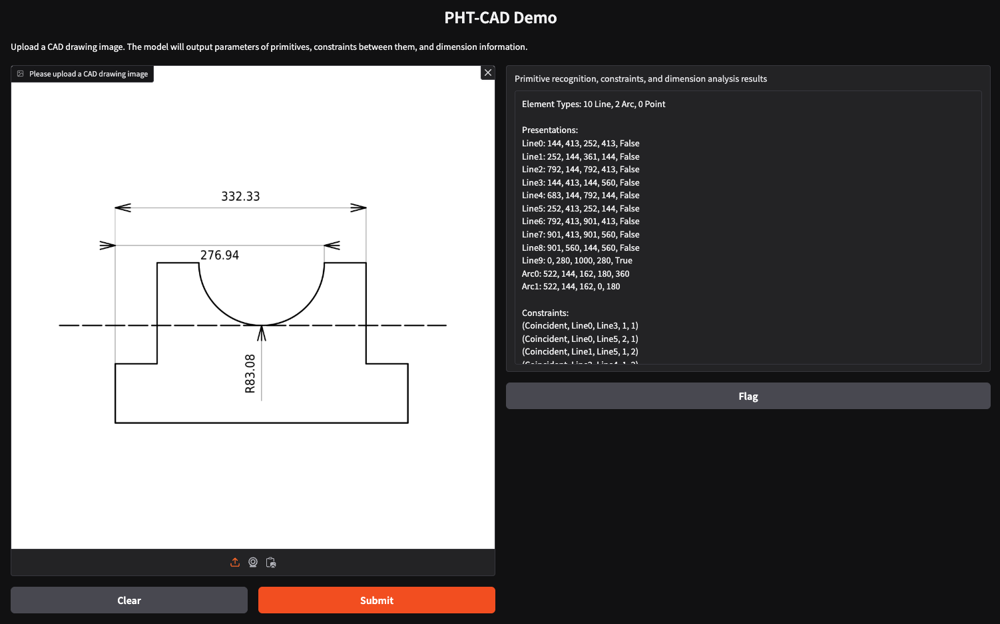

# PHT-CAD: Efficient CAD Parametric Primitive Analysis with Progressive Hierarchical Tuning


## Introduction

We propose PHT-CAD, a novel 2D PPA framework that harnesses the modality alignment and reasoning capabilities of Vision-Language Models (VLMs) for precise engineering drawing analysis. In PHT-CAD, we introduce four dedicated regression heads to predict corresponding atomic components. To train PHT-CAD, a three-stage training paradigm Progressive Hierarchical Tuning (PHT) is proposed to progressively enhance PHT-CAD's capability to perceive individual primitives, infer structural constraints, and align annotation layers with their corresponding geometric representations. Considering that existing datasets lack complete annotation layers and real-world engineering drawings, we introduce ParaCAD, the first large-scale benchmark that explicitly integrates both the geometric and annotation layers. ParaCAD comprises over 10 million annotated drawings for training and 3,000 real-world industrial drawings with complex topological structures and physical constraints for test. Extensive experiments demonstrate the effectiveness of PHT-CAD and highlight the practical significance of ParaCAD in advancing 2D PPA research.
    
You can view our paper through the following link: [Paper](https://arxiv.org/abs/2503.18147)


## ParaCAD benchmark


We present ParaCAD, the first large-scale 2D PPA benchmark that incorporates the annotation layer. ParaCAD includes 10.26 million annotated engineering drawings for training and 3,000 real-world industrial drawings for test. The samples for test exhibit higher topological complexity and adhere to physical constraints. The dataset can be accessed here: [Dataset](https://www.modelscope.cn/datasets/yuwenbonnie/ParaCAD-Dataset/summary)

## News and Updates
* 2025.03.26 🔥 We release an inference web UI.
* 
## Demo
 We release an inference web UI for the community to use our model. The web UI can be accessed at: [WebUI](https://5210-61-169-124-162.ngrok-free.app/). Some test results based on our model are shown in the following figure.



## Performance

**Table 1:** Comparison of PHT-CAD with SOTA methods in standard evaluation paradigm in Precise Sketch Images. 
| METHODS          | Acc↑  | ParamMSE↓ | ImgMSE↓ | CD↓   | CF1↑  | PF1↑  |
|------------------|-------|-----------|---------|-------|-------|-------|
| ResNet34 [5]     | 0.465 | 908       | 0.199   | 5.883 | —     | —     |
| PpaCAD [14]      | 0.524 | 589       | 0.195   | 5.097 | —     | —     |
| Vitruvion [12]   | 0.537 | 624       | 0.186   | 4.901 | 0.238 | 0.706 |
| PICASSO [7]      | 0.751 | 281       | 0.075   | 0.729 | —     | —     |
| PHT-CAD (w/o hand) | **0.859** | **52**    | **0.003** | —    | **0.868** | **0.917** |
| PHT-CAD          | **0.811** | **55**    | **0.004** | **0.008** | **0.784** | **0.879** |

**Table 2:** Comparison of PHT-CAD with SOTA methods in standard evaluation paradigm in Hand-drawn Sketch Images. 
| METHODS          | Acc↑  | ParamMSE↓ | ImgMSE↓ | CD↓   | CF1↑  | PF1↑  |
|------------------|-------|-----------|---------|-------|-------|-------|
| ResNet34 [5]     | 0.396 | 1048      | 0.240   | 6.908 | —    | —    |
| PpaCAD [14]      | 0.464 | 744       | 0.244   | 6.904 | —    | —    |
| Vitruvion [12]   | 0.461 | 685       | 0.237   | 5.258 | —    | —    |
| PICASSO [7]      | 0.658 | 365       | 0.117   | 1.090 | —    | —    |
| PHT-CAD          | **0.795** | **11**    | **0.005** | **0.010** | **0.7618** | **0.8665** |

**Table 3:** Comparison of PHT-CAD with SOTA methods in zero-shot evaluation paradigm.
| METHODS          | Acc↑  | ParamMSE↓ | ImgMSE↓ | CD↓   | CF1↑  | PF1↑  |
|------------------|-------|-----------|---------|-------|-------|-------|
| ResNet34 [5]     | 0.520 | 829       | 0.189   | 5.698 | —     | —     |
| PpaCAD [14]      | 0.562 | 601       | 0.272   | 6.600 | —     | —     |
| Vitruvion [12]   | 0.560 | 608       | 0.190   | 5.568 | 0.242 | 0.710 |
| PICASSO [7]      | 0.809 | 199       | 0.067   | 0.739 | —     | —     |
| PHT-CAD          | **0.923** | **50**    | **0.003** | **0.106** | **0.860** | **0.910** |

**Table 4:** Comparison of PHT-CAD with SOTA methods under dimension-based evaluation.
| METHODS          | Acc↑  | ParamMSE↓ | ImgMSE↓ | CD↓   | CF1↑  | PF1↑  |
|------------------|-------|-----------|---------|-------|-------|-------|
| PHT-CAD          | **0.840** | **50**    | **0.002** | —    | **0.860** | **0.910** |


## Citation

If you find this project useful, please consider citing our work:

```bibtex

